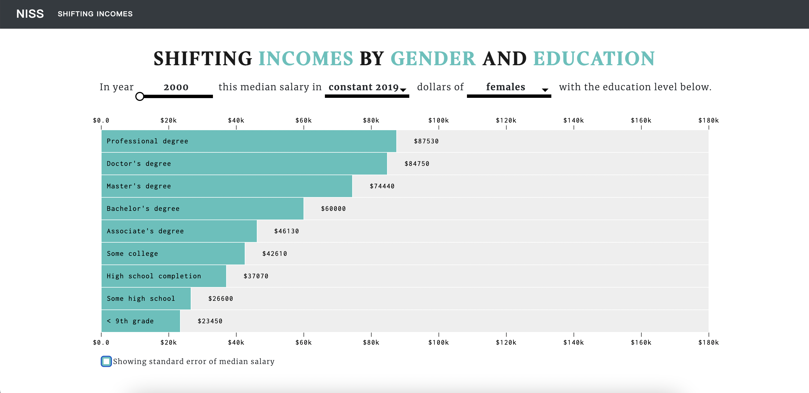

# Shifting Income by Gender and Education
<!-- PROJECT LOGO -->
<br />
<p align="center">
  <a href="https://github.com/ashizhou/shifting-income">
    
  </a>

  <h3 align="center">Shifting Income by Gender and Education</h3>

  <p align="center">
     	💫 Simple D3js Data Visualization 
    <br />
    <a href="https://github.com/ashizhou/shifting-income"><strong>Explore the docs »</strong></a>
    <br />
    <br />
    <a href="https://ashizhou.shinyapps.io/d3_rshiny_dashboard/">View Demo</a>
    ·
    <a href="https://github.com/ashizhou/shifting-income/issues">Report Bug</a>
    ·
    <a href="https://github.com/ashizhou/shifting-income/issues">Request Feature</a>
  </p>
</p>

<!-- TABLE OF CONTENTS -->
<details open="open">
  <summary>Table of Contents</summary>
  <ol>
    <li>
      <a href="#about-the-project">About The Project</a>
      <ul>
        <li><a href="#built-with">Built With</a></li>
      </ul>
    </li>
    <li>
      <a href="#getting-started">Getting Started</a>
      <ul>
        <li><a href="#prerequisites">Prerequisites</a></li>
        <li><a href="#installation">Installation</a></li>
      </ul>
    </li>
    <li><a href="#usage">Usage</a></li>
    <li><a href="#roadmap">Roadmap</a></li>
    <li><a href="#contributing">Contributing</a></li>
    <li><a href="#contact">Contact</a></li>
    <li><a href="#acknowledgements">Acknowledgements</a></li>
  </ol>
</details>

<!-- ABOUT THE PROJECT -->
## About The Project
  
  

  
  
This R Shiny app includes a **bar chart race** and aims to report **typical annual salary** of workers aged 25 and over by **gender, education level**, and **measure of inflation**. 

Check out [another entry](https://github.com/supertrashpanda/BeautifulBars) from my group.


### Built With
1. D3.js
2. R shiny
3. Bootswatch


<!-- GETTING STARTED -->
## Getting Started

### Installation

1. Clone the repo
```sh
git clone https:://https://github.com/ashizhou/shifting-income.git
```
2. Run
```
$ shiny::runApp('/shifting-income/src')
```

<!-- ROADMAP -->
## Roadmap
- [x] Slider 

- [x] Dropdown box

- [x] Bar chart race

- [x] R shiny 

- [x] Error bar

<!-- CONTRIBUTING -->
## Contributing

Contributions are what make the open source community such an amazing place to be learn, inspire, and create. Any contributions you make are **greatly appreciated**.

1. Fork the Project
2. Create your Feature Branch (`git checkout -b feature/AmazingFeature`)
3. Commit your Changes (`git commit -m 'Add some AmazingFeature'`)
4. Push to the Branch (`git push origin feature/AmazingFeature`)
5. Open a Pull Request


<!-- CONTACT -->
## Contact

Ashi Zhou - zhouyixiao.personal@gmail.com

Project Link - [repo](https://github.com/ashizhou/shifting-income)


<!-- ACKNOWLEDGEMENTS -->
## Acknowledgements
  
* [NISS Visualization Competition Page](https://www.niss.org/events/niss-statistically-accurate-interactive-displays-graphics-0)


